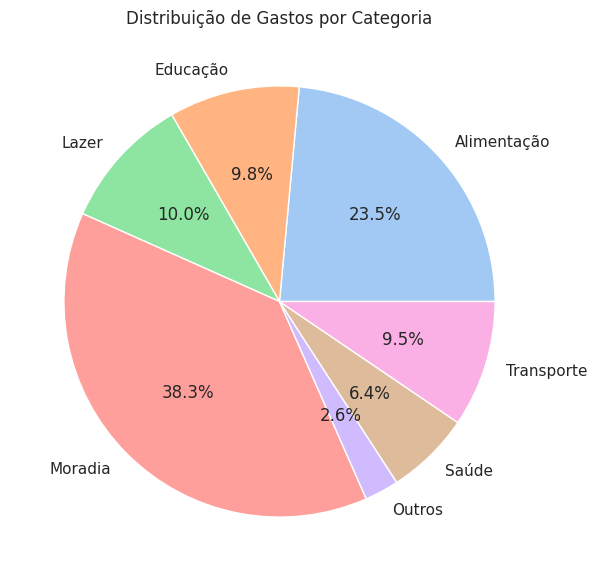
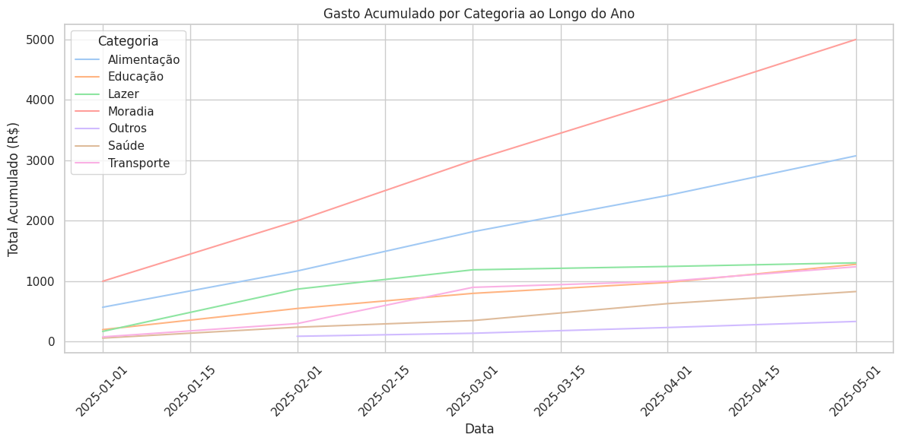
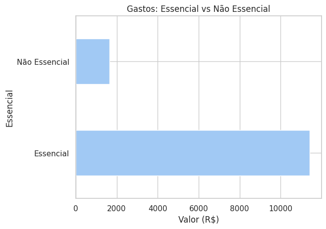
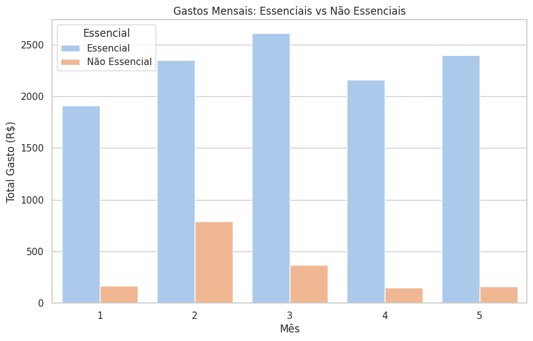
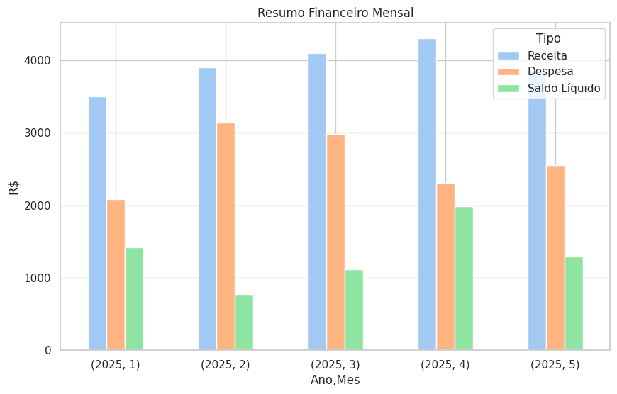
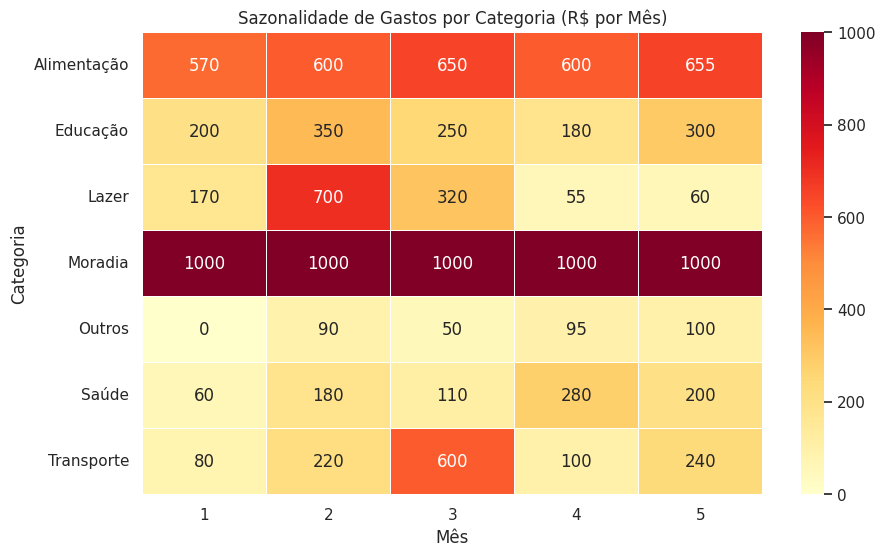
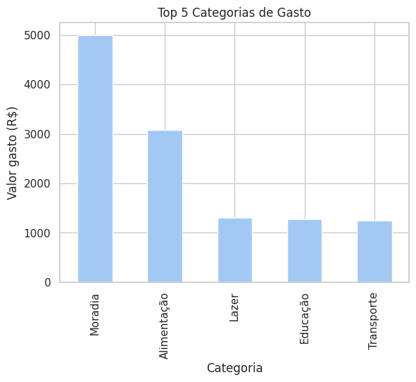
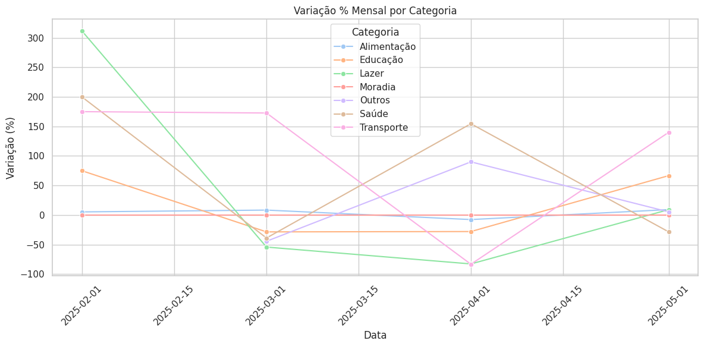

# 📊 Análise de Gastos Pessoais com Python

Este projeto tem como objetivo analisar e visualizar os gastos pessoais ao longo de 5 meses, utilizando bibliotecas de análise de dados em Python. Através de gráficos interativos e visualizações claras, é possível identificar padrões de consumo, sazonalidade, categorias com maior peso no orçamento e a relação entre despesas essenciais e não essenciais.

---

## 🔷 Estrutura do Projeto

◾ `dataset.csv` → Base de dados fictícia simulando os gastos mensais  
◾ `Código_para_limpeza_de_dados.py` → Script Python para tratamento de dados.  
◾ `Código_para_analisar_os_dados.py` → Script Python para análise e geração de gráficos  
◾ `Gráficos/` → Pasta com todas as visualizações geradas em `.png`

---

## 🔷 Objetivos da Análise

- Entender como os gastos estão distribuídos por categoria
- Acompanhar o crescimento acumulado dos gastos ao longo dos meses
- Comparar gastos essenciais vs não essenciais
- Avaliar o saldo mensal (receitas - despesas)
- Identificar variações mensais e sazonalidade de consumo

---

## 🔷 Insights Financeiros do Projeto

**Receita Total:** R$ 19.650  
**Despesa Total:** R$ 13.065  
**Saldo Líquido Geral:** Controle financeiro positivo com sobra de receita sobre despesas.

### Saldo Líquido Mensal (Ano 2025)

| Mês       | Receita (R$) | Despesa (R$) | Saldo Líquido (R$) |
|-----------|--------------|--------------|--------------------|
| Janeiro   | 3.500        | 2.080        | 1.420              |
| Fevereiro | 3.900        | 3.140        | 760                |
| Março     | 4.100        | 2.980        | 1.120              |
| Abril     | 4.300        | 2.310        | 1.990              |
| Maio      | 3.850        | 2.555        | 1.295              |

◾ Abril apresentou o melhor saldo mensal, com sobra de R$ 1.990.  
◾ Fevereiro foi o mês com menor saldo, devido ao aumento das despesas.

### Top 5 Categorias de Gastos

| Categoria    | Valor (R$) |
|--------------|------------|
| Moradia      | 5.000      |
| Alimentação  | 3.075      |
| Lazer        | 1.305      |
| Educação     | 1.280      |
| Transporte   | 1.240      |

◾ Moradia e alimentação representam quase 65% das despesas totais.  
◾ Lazer, educação e transporte também são categorias importantes para monitoramento.

### 🔸 Distribuição de Gastos por Categoria  
Gráfico de pizza mostra que **moradia** representa a maior parte das despesas (38,3%), seguida por **alimentação** (23,5%).  

### 🔸 Gasto Acumulado por Categoria ao Longo do Ano  
Mostra o crescimento contínuo dos gastos em cada categoria. Destaque para moradia e alimentação, que crescem linearmente mês a mês.  

### 🔸 Gastos: Essencial vs Não Essencial  
Visualização da proporção total de gastos essenciais (moradia, alimentação, transporte, saúde) vs não essenciais (lazer, educação, outros). Essenciais dominam o orçamento.  

### 🔸 Gastos Mensais: Essenciais vs Não Essenciais  
Análise mês a mês mostra que em **fevereiro** houve maior gasto não essencial, puxado por lazer e educação.  

### 🔸 Resumo Financeiro Mensal  
Compara receitas, despesas e saldo líquido de cada mês. Abril teve o melhor saldo líquido.  

### 🔸 Sazonalidade de Gastos por Categoria  
Heatmap que mostra meses com maiores gastos por categoria. Destaque para lazer em fevereiro e transporte em março.  

### 🔸 Top 5 Categorias de Gasto  
Confirma que **moradia**, **alimentação**, **lazer**, **educação** e **transporte** são os maiores vilões do orçamento.  

### 🔸 Variação % Mensal por Categoria  
Permite observar oscilações de comportamento. Exemplo: lazer teve alta em fevereiro e queda em abril.  

---

## 🔷 Tecnologias Utilizadas

◾ **Python 3.10+**  
◾ **Pandas** → manipulação de dados  
◾ **Matplotlib** & **Seaborn** → visualizações  
◾ **Google Colab / VSCode**

---

## 🔷 Próximos Passos

◾ Automatizar alertas de gasto excessivo por categoria  
◾ Aplicar clusterização para perfis de consumo  
◾ Transformar essa análise em um dashboard interativo (ex: Streamlit ou Dash)

---

## 🔷 Sobre Mim

Me chamo **Danieli Queiroz** e sou estudante de Banco de Dados com foco em construir uma carreira sólida na área de Ciência de Dados. Estou sempre aprendendo e aplicando projetos práticos como esse para desenvolver meu portfólio, além de estar constantemente estudando cursos complementares em plataforma como Coursera.

Se quiser trocar ideia sobre dados, fique à vontade para me chamar no [LinkedIn](https://www.linkedin.com/in/danieli-queirozprofissional/)!

---

⭐ Se você gostou do projeto, deixe uma estrela e compartilhe!
